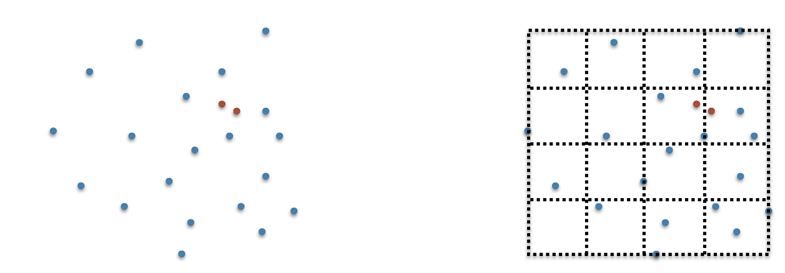

## Project 1: Finding the closest pair --two algorithms and an experimental evaluation

*** 
* __Assigned:__ Thursday, January 26
* __Due:__ Monday, February 6, 11:59pm
* Group policy: Partner-optional 
* Collaboration policy: Level 1


In this assignment you will write code to find the closest pair of
a set of points in the plane using two methods, and you will perform
an experimental evaluation of the two methods. The goal is to explore
the connection between theory and practice, to learn what quadratic
complexity means in practice, to go from an idea to a working algorithm, and to get some practice designing your code
 from scratch.


***

### Overview


The first algorithm you will implement is the naive, quadratic
algorithm.

For the second algorithm, you will __not__ implement the optimal
  divide-and-conquer algorithm, but instead you will develop an
  approach based on a widely used heuristic, gridding (described
  below). Gridding does not give good worst-case guarantees, but,
  under certain assumptions about the data, it is (very) efficient. Another plus of gridding is that it can be used for many other problems, not just for the closest pair. 




***

### The gridding heuristic


Imagine you know the bounding box (BB) that contains the points.  The
BB is specified by two x-values, `x1` and `x2`, and two y-values, `y1` and
  `y2`, such that all the points `p` in P are inside this box: `x1 <= p.x <=
  x2` and `y1 <= p.y <= y2`. The idea is to partition this BB using a
  grid of `k`-by-`k` cells, for a given value `k`. For example, if `k=2`, you
  divide the BB with a vertical line  at `x =(x1+x2)/2` and with a horizontal line at `y =
  (y1+y2)/2`, thus getting a partition of the BB into a 2-by-2 grid.

  Next we want traverse the points, for each point `p` find which
grid cell it belongs to, and add it to that cell. At the end 
the grid will contain all points in `P`, nicely stored in the
cells they belong to. 


***

### Using the grid to find the closest pair of points


You will need to come up with an algorithm to compute the closest
pair in `P`. Let `p` be an arbitrary point in `P`. You'll want to compute the
closest neighbor of `p`.  Denote this point by `q`.  There are two casses to consider:

1. Point `q` is in the same cell as `p`.
2. Point `q` is in a different cell. Which grid cells would you search
for `q`, first?

Consider the possibility that a cell may be empty, and specificaally
that all cells that you search first are empty.   How would you
continue the search for q in this case? 
 


***

### The bounding box of the points


Generally speaking you will want to compute the bounding box of your
point set. In this project, however, you will generate the points
yourself, and when doing so you will specify a range. For example, you
might generate x coordinates in the range [ 100, 200] aand
y-coordinaates in the range [-200, 200]. This means the BB is x1=100,
x2=200, y1=-200, y2=200.


***

### The interface of your code


* You will  generate the set of points randomly. Assume they have real
  coordinates. For consistency, assume the range of the coordinates is
  <tt>[0; 1,000,000]</tt>.
  
* The number of points, `n`, should be read as a command
  line argument. For example,  
  
  ```
    [ltoma@lobster] ./closest 100
  ```

means that it will generate and compute on `n=100` points.

* Make your functions print out the time they take to run. That way you
  can run your code with increasingly larger values for <tt>n</tt> and
  record the results.
  
  
* Implement the functions that compute the closest pair as two
  separate functions, one corresponding to the naive algorithm and one
  to the gridded approach. For example,

```
//compute and print the closest pair in P using the naive algorithm 
void closest_naive( array of points P)

//compute and print the closest pair in P using a gridded approach
void closest_grid( array of points P)
```

Note that (unless you use vectors) you'll also need to pass in the size of the array. 


* Make each function print the points that are closest so that it's easy
to compaare and check that the two functions actually find the same pair.


* For the gridded approach, use a grid of `k`-by-`k`
  cells. You will neeed to choose the value of `k` in order to
  make the algorithm efficient (note that for `k=1`, the gridded
  approach is the saame as the naaive approach).  Because the points
  are uniformly distributed, you can estimate for e.g. how many points
  you expect to fall in each cell.  Think of how you would go about
  finding the closest pair, and how the number of points per cell may
  influence it.  Using this insight, what value of `k` do you
  pick?

  
* Ideally, your code will work correctly for any value of `k` you
    choose<. That is, it will work if you set `k=1`, and will work
    if you set `k` to such a large value that most of the cells will be
    empty; for example `k=n` will mean most cells will be empty since
    there are n<sup>2</sup> cells and n points.


* The value of `k` is either specified by the user on the command line along with `n`, or is a global variable that you can set at the top of your file. 


***

### Experimental evaluation


Denote the number of points by `n`. Generate sets of increasingly larger
size sizes, and time both methods separately, until the difference in
running times is significant. For e.g. you could pick
```
n=10, 100, 1000, 10000, ...
```
and so on, until one of the algorithms becomes too slow.   Time each method separately, and record the running times in a table. 


***

### What and how to turn in


You will receive the assignment on GitHub, but there will be no
startup code. Push your code into your github repository for this
assignment.

Files: For this lab, write your code in a single file and call it
`closestPair.c`. Add a header file, `closestPair.h`, a `Makefile` and a `README`.

The README file should contain: 
- a brief, high-level description of how you find the closest pair using the grid
- a brief decsription of how you chose the grid size and
why, and what's the expected running time assuming the points are
uniformly distributed
- the table with the experimental running times of your two algorithms, for various values of
  `n`


Do not turn in any object  or executable files.


***
### Evaluation


Your code will be evaluated on the correctness of the two algorithms,
on the completeness of the README file (whether it includes
everything it's suppossed to) and on the structure and quality of
your code.
