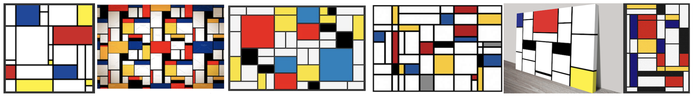

## Project 3:  Abstract art with kd-trees


*** 
* __Assigned:__ Monday, February 20
* __Due:__ Wednesday, March 1st, 11:59pm
* Group policy: Partner-optional 
* Collaboration policy: Level 1


In this assignment you will write code to build a two-dimensional
kd-tree for a set of points in the plane, and to render it in
[Mondrian](https://en.wikipedia.org/wiki/Piet_Mondrian) style.




***

### Overview

There are several parts to this asignment: building the kd-tree, 
rendering it,  and fine-tuning the initial points and colors to make
it look artistic or interesting. 

Your program will take as argument on the command line the number of
points.  For example,  
  
  ```
    [ltoma@lobster] ./mondrian 100
```

means that  it will generate a Mondrian-like painting  on `n=100` points.

For this asignment, make your `point2D` store the coordinates as `doubles`, not `ints`.

Your default initializer will generate the set of points randomly.
Feel free to add several initializers; in fact, you could start with
all the initializers you had for Project 2. For consistency, assume
the range of the coordinates is `[0; 1,000,000]` (this value should be
A CONSTANT, of course).


***

### Representing the kd-tree

You will need to define a data structure for a kd-tree. Since a
kd-tree is a binary tree, we can use a similar recursive node
structure as for a binary tree. Basically a tree consists of nodes,
where a node stores some information about the node and pointers to
its left and right child.

A kd-tree node will need to know its type (is it a
regular node or a leaf node); if a leaf node, it will need to know the
point inside it; otherwise, if a vertical node, it will need to
know the x-value of the vertical line through it; if a horizontal
node, it will need to know the y-value of the horizontal line through it.

An example of a kd-tree node is below (feel free to modify it as needed). 


```
typedef struct _treeNode {
	point2D p;
	          /* If this is a leaf node,  p represents the point stored in this leaf. 
                  If this is not a leaf node,  p represents the horizontal or vertical line
                  stored in this node. For a vertical line, p.y is ignored. For a horizontal 
		  line, p.x is ignored.
                  */
	int type;
		  / * this can be HORIZONAL, VERTICAL, or LEAF
                    depending whether the node splits with a horizontal line or  vertical line.
                    (note: this should be an enum).
                  */
	treeNode  *left, *right;
		/* left/below and right/above children. */
} treeNode; 
```

A kd-tree will store the pointer to the node that's the
root of the tree. It's  useful to store the number of points in
the tree, and also the height, so we'll do that:

```
typedef struct _kdtree{
   treeNode *root;     //root of the tree
   int n;              //number of leaves/points  in the tree
   int height;         //its height
} kdTree;
   ```


In C++, it will look more like this:

```
class TreeNode {
  private: 
     point2D *p; 
     int type; 
     TreeNode *left, *rigt; 
  public: 
     TreeNode(point2d p); 
     ~TreeNode();
};

class Kdtree {
  private: 
     TreeNode *root; 
     int count ;  //number of leaves/points in the tree
     int height;     
  public:
     Kdtree(vector<point2d>& points); //build the kd-tree from the points 
     ~Kdtree();
     ...
};
```


### Building a kd-tree


The main function on a kd-tree will be to construct it from a vector
of points.  Start by writing the basic primitives for operating on a
`treeNode` and on a `kdTree` (such as creating a treeNode, printing a
node, printing a tree, and so on)---this last one will come in handy
for debugging.

In addition to printing all nodes in a kd-tree, include a function
that prints some basic info about the kd-tree (the number of nodes and
its height), but not all the nodes.  You will call this function after you build the tree to
see basic info about the tree.

The function to build a  kd-tree will take the array of points as
parameter. In C-style it might look like this:  

```
/* Build a kd-tree for the set of points, where each leaf cell contains  1 point.    
   Return a pointer to the tree.
*/
kdTree*  build_kdtree(vector<point2d> & points)
```

If you create a class, you'd have a constructor that does this: 

```
  public:
     Kdtree(vector<point2d>& points);  
```

Note: Since your coordinates are `doubles` and you generate the points
randomly, its unlikely that you'll get coincident points in your set
of points (if your coordinates are `ints`, you'll need to consider this
issue). Below we assume that the points are __distinct__.

The first step in building a kd-tree from points is to sort the points  by
x-coord and by y-coord , respectitvely (check out `std::sort` for sorting vectors).

```
vector<point2d> points-by-x, vector<point2d>& points-by-y;
```

When using `std::sort`, you will need to pass as a third parameter a
function that compares two elements, and returns `true` if the
first element is to be considered smaller than the second element, and
`false` otherwise.

Note that points that have same x-coordinate or same y-coordinate can cause
issues with the partition depending on how you handle ties. To handle
these cases elegantly think of using a comparison function that
 orders the points lexicographically  (compare the first
coordinate, and if equal, compare the second coordinate). With a lexicographic ordering, the only ties are for duplicate points (of which we assumed there are none). 


```
//return true  if a < b 
//orders the points lexicographically by (x,y)
bool leftToRightCmp(const point2d & a, point2d & b) {
    ...
}
//return true  if a < b
//orders the points lexicographically by (y,x)
bool bottomToTopCmp(point2d& a, point2d& b) {
   ...
}
```


Once you sort the points  left-to-right, and bottom-to-top,  you will want
to pass these  to a helper function to build the kd-tree recursively.  It might look something like this:

```
treeNode* build_kdtree_rec(vector<point2d> & points-sorted-by-x, vector<point2d>& points-sorted-by-y, int cut_type)
```

This helper function should build the kd-tree recursively. It should
probably take the type of the cut as a parameter and use it to decide
whether to split vertically or horizontally.


### Degenerate cases

You want to stop the recursion when the node contains 1 point.  The main challenge will be make sure the recursion always stops (no infinite recursion).

The median is the value in the middle index of the sorted array (sorted by x or by y, depending on the type of node). One way to set up the recursive calls is to put all points with x-coord smaller or equal to the median to the left, and the others on the right. Think of what happens when you have points with same coordinates, for example consider the case of points on the same vertical line. All x-coordinates are the same, and if you distribute all the points with x-coord smaller or equal to the median to the left, all points end up on the left side. You need to think if its possible to generate infinite recursion.

For e.g. consider the points (2,6), (3,6), (3,5) examined in the x-coordinate. Middle point is (3,6). But the third's point x-value is also 3, so it will go on the left side. Thus this passes the entire array to the next level. Then we examine them in the y-coordinate: (3,5), (3,6), (2,6) Middle point is (3,6). But the third point has same y-coord as the median, which means it will also go on the left side. Thus this passes entire array to next level again, i.e. infinite recursion. These points are not coincident but are collinear in just the wrong way to cause infinite recursion.

There are other ways to handle this, but an elegent way is to use the `leftToRightCmp()` instead of just comparing by x. In `leftToRight` order, no two points are equal (unless there are duplicate points, which we assume there aren't). All points before the median are strictly smaller than the median in `leftToRight` order. Put differently, a point p goes to the left of the median if p is smaller than the median in `leftToRight` order, and goes to the right of the median otherwise. This way the points have an ordering with no ties and there is no infinite loop. Using a comparator with no ties makes it all work very nicely. 


### Maintaining `points-sorted-by-x` and `points-sorted-by-y` through  the recursive calls

Once you have the median of the points, you will want to
partition the points into `P1` and `P2` ----the sets of points before and
after the median.  And, you'll  need sorted versions of these sets to pass to the
recursive calls:
```
vector<point2d>  P1-sorted-by-x, P1-sorted-by-y, P2-sorted-by-x, P2-sorted-by-y; 
```

 You could generate `P1` and `P2` and sort them. Overall this  sort at each step of the recursion would result in an overall O(n
 lg <sup>2</sup> n)   time for building the kd-tree, which is not optimal.

Instead, the  point is to sort
 the points only once, at the beginning.
 For each of `P1` and `P2`, you can generate the points in `P1` and `P2` in left-to-right and bottom-to-top order  simply 
 by traversing   `points-sorted-by-x` and `points-sorted-by-y`. 

For example, if you at a node with a horizontal split,  `P1-sorted-by-x`
 and `P2-sorted-by-x` are the first and second half of
 `P1-sorted-by-x`, respectively.  The points in `P1-sorted-by-y` and
 `P2-sorted-by-y` can be generated by traversing `P-sorted-by-y`
 and comparing each point to the median: 

```
if leftToRight(p, median) == true: p goes to P1-sorted-by-y
else p goes to P2-sorted-by-y
```


### Rendering the kd-tree

Using code from previous assignments, set up OpenGL and write a
function to render the kd-tree so that it looks similar to a
Mondrian painting. Basically, you will want to draw a filled
rectangle/polygon for each leaf node, corresponding to the region of
that leaf. One way I can think of doing this is storing the region of
a node with each node; another way is to compute the region of a node on the fly:  make your recursive `draw`
function take as parameter the bounding box of the region
corresponding to the node it is called upon.  The input points are
generated in the range [0,WINDOWSIZE] x [0, WINDOWSIZE]. This is the
region fo the root.


### What and how to turn in


You will receive the assignment on GitHub, but there will be no
startup code. To submit, simple push your code into your github
repository for this assignment. Don't forget to add a README file with
a brief, high-level description of the project.

Do not turn in any object  or executable files.


***
### Evaluation


Your code will be evaluated on the correctness of the algorithm, on
 the visuals of the image, and on the structure and quality of your
 code.


### Start early,  program well and enjoy the proces! 
