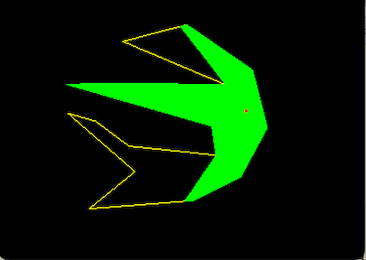
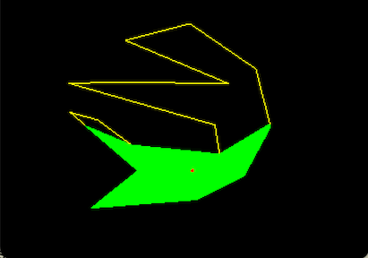
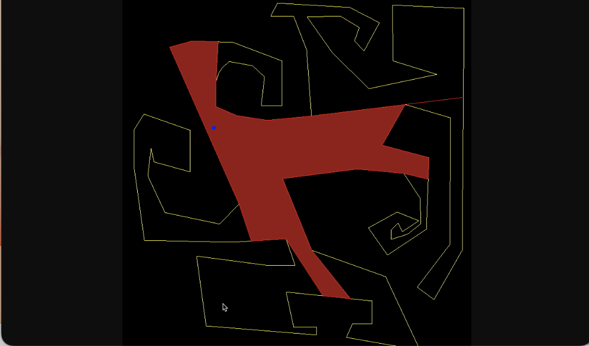

## Project 4:  Night at the Museum 


*** 
* __Assigned:__ Monday, February 27
* __Due:__ part 1: Friday, March 10, 11:59pm, part 2: Monday April 3rd 
* Group policy: Partner-optional 
* Collaboration policy: Level 1

***

In this project you will write code to find the visible area of a guard in a museum. The input will be  a simple, non-intersecting polygon in the plane which represents the boundary of the museum,  and   a point inside this polygon which represents a guard. The goal  is to come up with and implement an algorithm that computes and displays the part of the museum that's visible to the guard.  Note that the area that's visible must be inside the museum (cannot see through the walls), and must be a polygon (cannot have holes and islands).  We'll refer to it as the _visible polygon_. 




To manage complexity we'll split this project into two parts:

Part 1:  Read the polygon and the guard from the user, compute the visible polygon and display it.

Part 2: Extend so that the guard is moving inside the polygon and the visible area is re-computed and displayed as the guard is moving. Move the guard so  that the guard does not get stuck in a corner of the polygon.


***

### The interface

Unlike previous projects this one does not need to take any arguments on the command line. To initialize a polygon and the position of a guard inside the polygon you will use the mouse (see examples in class). 

The user should  press `s` to start the polygon, then click in the window on the desired location of the vertices, then press `e` when the polygon is done.    The user is expected to enter the polygon in counter-clockwise boundary order. It's always helpful (and good style) to print a message as the program starts letting the user know the interface: 
``` 
press 's' to start entering the vertices of the polygon and 'e' to end. 
(Please enter the vertices counter-clockwise)
```

Once the user is done entering the polygon, your code should check whether the polygon is simple (by implementing a function to do that); if it is simple, it should print a message that the test is passed: 
```
testing if polygon is simple: yes
```
Otherwise, it should print a message that the polygon is not simple and clear the polygon so that the use can start again.  This suggest writing aa function to test whether two segments intersect, which might look like this: 
```
\\return true if ab intersects with cd 
bool seg_seg_intersect(point 2d a, b, c, d)
```
 
 
 
Once the user is done entering a simple polygon,  the next step is to click on the desired location of the guard.  In terms of interface,  no specific requirements.  You could assume that once the polygon is finished, any mouse click  represents a guard; or you can require that the user presses `g` before clicking on the location of a guard, otherwise the mouse clicks are ignored.  This is up to you, but make sure to document it in the Readme file and also while the program is running so that aanyone is able to run your code (for e.g. you could make your `keypress` function  print the interface of your code when  key `h` is pressed).


The guard has to be inside the polygon. You can assume that the user enters a guard that is inside.   Ideally (extra credit) you will write  a function to test whether a point is inside a polygon ---- this is a nice basic algorithm to know about and we'll talk about this in class. If you want to work on this I would suggest you leave it to the end. We'll discuss the basic idea in class, but the degenerate cases are messy;  there is full pseudocode in the O'Rourke textbook which I suggest you check out and follow.

Once the polygon and the guard are set, call your function to compute  the visible polygon, and then call the function to render it. 


### Computing the visible polygon

The crux of this project is to come up with an algorithm to compute the visible polygon of the guard. We have not talked specifically about this problem in class and the goal  is to come up with a solution on your own. In terms of running time, a quadratic algorithm will suffice. 

Towards an algorithm:  Draw a couple of polygons and try out some cases.  Start with simple polygons, such as convex.   How do you compute the visible polygon of a point inside a convex polygon? Now move to non-convex polygons: what is different? 

As we try out various cases we make a couple of observations: 

* Not all vertices of a non-convex polygon are necessarily visible. This suggests a helper function to determine if a vertex of a polygon is visible from the guard point `p`,  which might look something like this:   

```
\\return true if polygon[i] is visible from point p
bool isVisible(Vector<point2d> polygon, int i, point2d p) 
```

* The visible polygon consists of the vertices of the museum polygon that are visible, possibly interleaved with points interior to the edges of the museum that represent  intersections with rays from the guard.  The question is: how to compute these interior points? You will need to shoot rays through some vertices of the museum (which ones?), and, for each ray, find its first intersection with the boundary of the museum.   Some questions you will need to answer are:  through what vertices do you shoot the rays, and how do you get the points along the boundary of the visible polygon, in the right order? 




### Rendering the visible polygon 

You will need to render the visible polygon filled. Note that visible polygon is not necessarily convex. 

OpenGL has two modes for rendering polygons: boundary (`GL_LINE` mode) or filled (`GL_FILL` mode). To select one or the other you need to set the polygon mode: 

```
glPolygonMode(GL_LINE);
//glPolygonMode(GL_FILL);
```

Something to be aware of is that openGL can only render filled polygons that are __convex__. This seems like a big limitation, however if you think about it a little it becomes clear that it is not straightforward how to render a non-convex polygon filled: to do that essentially you need to compute the triangulation of the polygon, and then render one triangle at a time. Computing a triangulation of a non-convex polygon is a bigger problem which we'll talk about in the coming weeks, and OpenGL does not do it  as part of  the `glDraw` function.  

Even though it's not convex, the visible polygon has some nice properties that will make rendering it a lot easier!


__Rendering a transparent polygon:__  If you want transparency you can specify the color using 4 values, the usual RGB values plus a value that represents the transparency. You also need to tell OpenGL to blend. [to continue]


### Some ideas to take this a step up 

If you want a challenge,  try to come up with an improved algorithm that runs in `O(n lg n)` using a radial sweep (hint: process the vertices in radial order around the guard).  Several algorithm are known for computing the visible polygon faster
than the quadratic algorithm: the algorithm by  Joe and Simpson runs in `O(n)` time, and the one by Asano in `O(n lg n)` time. A
recent algorithm by Mungiu et al seems to be the fastest in practice.   If you are considering an improved algorithm the papers listed below may be helpful.  If you want to go down this path you will demo your code in class, get a round of applause, extra credit, and generally feel amazing.   


*  <a  href="http://cs.smith.edu/~jorourke/books/ArtGalleryTheorems/Art_Gallery_Chapter_8.pdf">Joe
  and Simpson's O(n) visibility polygon</a>
											  
 * <a href="https://arxiv.org/pdf/1403.3905v1.pdf">Efficient computation  of visibility polygons</a> (2014)
 
 * <a href="https://doc.cgal.org/latest/Visibility_2/index.html#Chapter_2D_Visibility_Computation">CGAL
  visibility algorithms</a>
  
If you try www searching, you may be surprised to find that this is a popular problem with cool applications and visualizations. Here's some links which I found interesting/relevant: 

* <a href="http://ncase.me/sight-and-light/">Sight-and-light</a> 

* <a href="https://legends2k.github.io/2d-fov/">Field of view and los in 2d</a>
  
  
* <a href="http://www.redblobgames.com/articles/visibility/">2d
  visibility</a>

 * <a href="https://davidglavas.me/computing-visibility-polygons/">Glavas
  blog on computing visibility polygons</a>


#### Some more ideas for extra features: 

* Implement testing whether the point is inside the polygon (the ray crossing algorithm). 

* Add more than one moving guards, and render their visible areas transparently, so that the overlap is easy to see, like so:   <a href="https://tildesites.bowdoin.edu/~ltoma/teaching/cs3250-CompGeom/fall21/Assignments/A5-artGallery/dylanisaac-guarding-demo.mov">demo1</a> |  <a href="https://tildesites.bowdoin.edu/~ltoma/teaching/cs3250-CompGeom/fall21/Assignments/A5-artGallery/wk-moving_guards.mov">demo2</a>

 

*** 


### What and how to turn in
You will receive the assignment on GitHub, but there will be no startup code. To submit, simple push your code into your github repository for this assignment. 

Add a README file containing:  a brief, description of the project;  info on the interface, i.e. everything one  needs to  know in order to run your code; a list of known bugs (if any) and when they happen;  a list of the main functions you implemented (); any extra features you implemented. 

Do not turn in any object or executable files.


### Evaluation

Your code will be evaluated on the supporting functionality you implemented, on the correctness of the visibility polygon and the number of test cases your algorithm passes,  and on the structure and quality of your code. 
- appropriate documentation in README.md  
- checking if the polygon entered by the user is simple 
- checking if the guard entered by the user is inside or outside the polygon [extra credit]
- rendering the visibility polygon filled 
- the guard is moving properly and  does not get stuck in corners 
- multiple (moving) guards [extra credit]
- improved algorithm [extra credit]


***

This project is significantly harder than the previous ones and has many pieces that you'll have to put together (such as segment intersection) while handling degenerate cases. It is crucial that you develop your code one piece at a time, and test before you move on to the next.  From the beginning, design your code  knowing that you will spend 90% of the time debugging it.   Make the debugging easier.

### Start early, program well and enjoy the proces!

