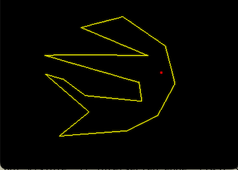
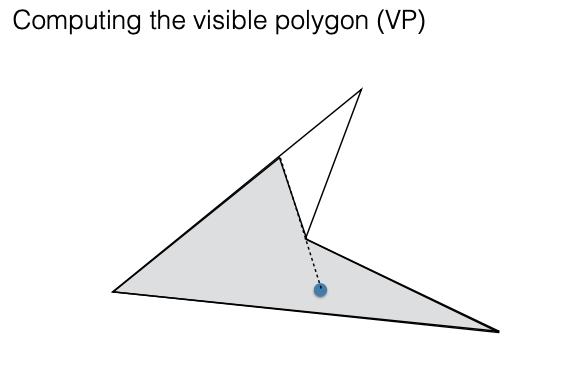
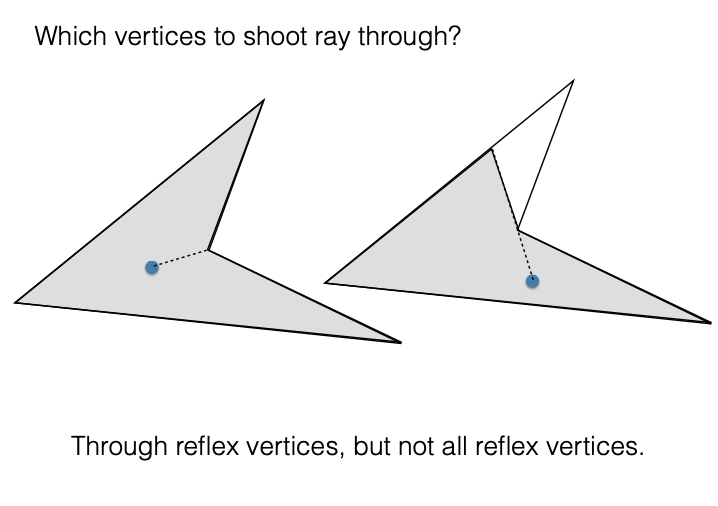
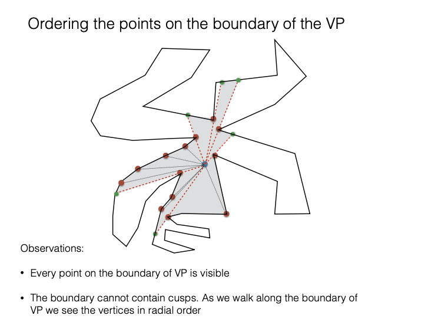

## Project 4:  Night at the Museum 


*** 
* __Assigned:__ Monday, February 27
* __Due:__ part 1: Friday, March 10, 11:59pm, part 2: Monday April 3rd 
* Group policy: Partner-optional 
* Collaboration policy: Level 1


In this project you will write code to find the visible area in a museum. The input will be  a simple, non-intersecting polygon in the plane which represents the boundary of the museum and   a point inside this polygon that represents a guard. The goal  is to come up with and implement an algorithm that computes and displays the part of the museum that's visible to the guard. To manage complexity we'll split it into two parts:

Part 1:  Reaad the  polygon and the guard from the user,  compute the visible polygon and display it.

Part 2: Extend so that the guard is moving inside the polygon, and the visible area is re-computed and displayed as the guard is moving. Move the guard so  that the guard does not get stuck in a corner of the polygon.





***

### The interface

To initialize a polygon and the position of a guard inside the polygon you will use the mouse (see examples in class). 

The polygon has to be simple aand entered in counter-clockwise boundaary order. To start, the user should make sure that the polygon entered is simple and in ccw order. Ideally there would be a function that tests whether a polygon is simple.


The guard has to be inside the polygon. To start, the user should make sure it is inside. Ideally there would be a function that tests whether a point is inside a polygon ---- we'll talk about this in class, and it's a nice idea (the degenerate cases are messy, but there is full pseudocode in the textbook).

Once the polygon and the guard are set, run your algorithm that computes that polygon that's visible and render it with a different color. In  OpenGL can render a polygon in two ways: just its boundary (GL_LINE mode), or filled (GL_FILL mode), by turning on one of:

```
glPolygonMode(GL_LINE);
//glPolygonMode(GL_FILL);
```

Something to be aware of is that openGL can only render filled polygons that are convex. This seems like a big limitation, however if you think about it a little it becomes clear that it is not straightforward how to render a non-convex polygon filled --- to do that essentially you need to compute the triangulation of the polygon, and then render one triangle at a time. Computing a triangulation of a non-convex polygon is a bigger problem which we'll talk about in the coming weeks, and OpenGL does not do it  as part of 'glDraw'.  Luckily the visible polygon has some nice properties that make rendering it a lot eassier.   You will need to render the visible non-convex polygon filled.


### Computing the visible polygon

The crux of this assignment is to come up with an algorithm to compute the visible polygon of the guard. We have not talked specifically about this problem in class and the goal  is to come up with a solution on your own. In terms of running time, a quadratic algorithm will suffice. 


Towards an algorithm:  Draw a couple of polygons and try out some cases.  Start with simple polygons, such as convex.   How do you compute the visible polygon of a point inside a convex polygon? Now move to non-convex polygons: what is different? 

As you try out various cases we maake a couple of observations: 

1. Not all vertices of a non-convex polygon are necessarily visible. This suggests a helper function to determine if a vertex of a polygon is visible from the guard point which might look something like this:   

```
\\return true if polygon[i] is vissible from point p
bool isVisible(Vector<point2d> polygon, int i, point2d p) 
```

2. The visible polygon consists of  the vertices of the polygon that are visible, and points intertoor to the edges of the polygon thata represenet the interesection of rays from the viewepoint p.  You will need to shoot rays through some vertices, and For each ray, find its first intersection with the boundary of the polygon.

Some questions you will need to answer are:  through what vertices do you shoot the rays, and how do you get the points along the boundary of the visible polygon, in the right order? 

[](guard7.png)


### Some ideas to take this a step up 

If you want to go above and beyond and implement an improved algorithm, a first idea is to try a radial sweep with a priority queue, which will leaada to an `O(n lg n)' aapproach. There are recent results that show how to compute this in `O(n)` timee. If you are considering an improved algorithm, the papers listed below may be helpful.  Just a warning that if you want to go down this path, make sure that you allocate  extra time as it is significantly harder. You will demo your code in class, get a round of applause, extra credit, and most of all you will feel damn good.   


Several algorithm are known for computing the visible polygon faster
than the naive O(n<sup>2</sup>) algorithm: the algorithm by  Joe and
Simpson runs in O(n) time, and the one by Asano in O(n lg n) time. A
recent algorithm by Mungiu et al seems to be teh fastest in practice. 

<ul>
  <li><a
  href="http://cs.smith.edu/~jorourke/books/ArtGalleryTheorems/Art_Gallery_Chapter_8.pdf">Joe
  and Simpson's O(n) visibility polygon</a>
											  
  <li><a href="https://arxiv.org/pdf/1403.3905v1.pdf">Efficient
  computation  of visibility polygons</a> (2014)
  <li><a href="https://doc.cgal.org/latest/Visibility_2/index.html#Chapter_2D_Visibility_Computation">CGAL
  visibility algorithms</a>
  
</ul>

#### Some more ideas for extra features: 

Implement testing whether the point is inside the polygon (the ray crossing algorithm). 

Add more than one moving guards, and render their visible areas transparently, so that the overlap is easy to see.


#### Some cool apps: 
<ul>
<li><a href="http://ncase.me/sight-and-light/">Sight-and-light</a> 

  <li><a href="https://legends2k.github.io/2d-fov/">Field of view and los in 2d</a>
  
  
  <li><a href="http://www.redblobgames.com/articles/visibility/">2d
  visibility</a>

  <li><a
  href="https://davidglavas.me/computing-visibility-polygons/">Glavas
  blog on computing visibility polygons</a>

</ul>


### What and how to turn in
You will receive the assignment on GitHub, but there will be no startup code. To submit, simple push your code into your github repository for this assignment. Don’t forget to add a README file containing:  a brief, description of the project; how to use your code (what keys to press to drawa the polygon and anything else in the interface); a list of bugs (if any) and when they happen;  a list of the main functions you implemented (); any extra features you implemented. 

Do not turn in any object or executable files.

### Evaluation

Your code will be evaluated on the supporting functionality you implemented, on the correctness of the visibility polygon and the number of test cases your algorithm passes,  and on the structure and quality of your code. 
- appropriate documentation in README.md  
- checking if the polygon entered by the user is simple 
- checking if the guard entered by the user is inside or outside the polygon [EXTRA CREDIT]
- rendering the visibility polygon filled 
- the guard is moving properly and  does not get stuck in corners 
- multiple guards [EXTRA]
- 


This project is significantly harder than the previous ones, and has many pieces that you'll have to put together (such as segment intersection) and handle degenerate cases. It is crucial that you develop your code one piece at a time, and test befor eyou move on to the next.  

### Start early, program well and enjoy the proces!

