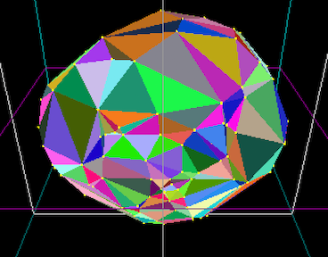

## Project 5:  3d Convex Hull 

*** 
* __Assigned:__ Thursday, April 6
* __Due:__  Sunday April 16th 
* Group policy: Partner-optional 
* Collaboration policy: Level 1

In this project you will write code to compute the convex hull of a set of points in 3D, using either gift wrapping or the incremental algorithm, both of which run in quadratic time.  

***

### Overview

You will receive starter code on Github which handles the interface, generating the points and rendering them.  Your main task is to fill in  the function the computes the hull. You can choose to implement either the gift wrapping or the incremental algorithm. 

Whichever algorithm you chhose to implement, we will make the following simplifications: 
* store the hull as a vector of faces. you do not need to store the topology between faces and edges (i.e.  what faces and edges are adjacent  to a face)
* you do not need to handle  coplanar points. Most likely this mean that for coplanar faces, you will generate many and possibly overlapping triangles -- that is fine, given the timing of this project.   Whiel at it, consider how you might solve this problem if you had more time.  

### What and how to turn in
You will receive the assignment on GitHub. To submit, simple push your code into your github repository for this assignment. Do not turn in any object or executable files.

Add a README file containing:  a brief, description of the project;  info on the interface, i.e. everything one  needs to  know in order to run your code; a list of known bugs (if any) and when they happen;  a list of the main functions you implemented (); any extra features you implemented. 

Also: Capture a movie of the screen while you demo your code and upload it to github, either in #general or a a direct message.  To demo, no voice, just run your code and show what it can do (To capture a movie  on a Mac press `shift+command+5` and then choose the option that says `record selected portion`). 

***

### Start early, program well and enjoy the proces!

This project is significantly harder than the previous ones and has many pieces that you'll have to put together (such as segment intersection) while handling degenerate cases. It is crucial that you develop your code one piece at a time, and test before you move on to the next.  From the beginning, design your code  knowing that you will spend 90% of the time debugging it.   Make the debugging easier.

